# ASIC Implementation Flow

## Overview

After completing the RTL design and functional verification of the 8-bit RISC Processor, the design was taken through a digital ASIC implementation flow using Cadence Genus and Innovus tools.

The objective of this stage was to transform the verified Verilog RTL design into a physically realizable integrated circuit while satisfying timing, area, power, and routing constraints.

---

## Design Flow

```text
RTL Design
    ↓
Functional Verification
    ↓
Logic Synthesis (Genus)
    ↓
Timing / Area / Power Analysis
    ↓
Floorplanning
    ↓
Power Planning
    ↓
Placement
    ↓
Routing
    ↓
Post-Route Timing Analysis
    ↓
Connectivity Verification
    ↓
DRC Verification
    ↓
Geometry Verification
    ↓
Post-Synthesis Simulation
```

---

## Logic Synthesis

Logic synthesis was performed using Cadence Genus. During this stage, the Verilog RTL description of the processor was translated into a gate-level netlist using the target standard-cell library.

The synthesis process optimized the design for timing and area while preserving the intended functionality of the processor.

### Outcomes

* RTL converted into gate-level netlist
* Technology mapping completed
* Timing constraints applied
* Area and power reports generated

### Synthesis Result

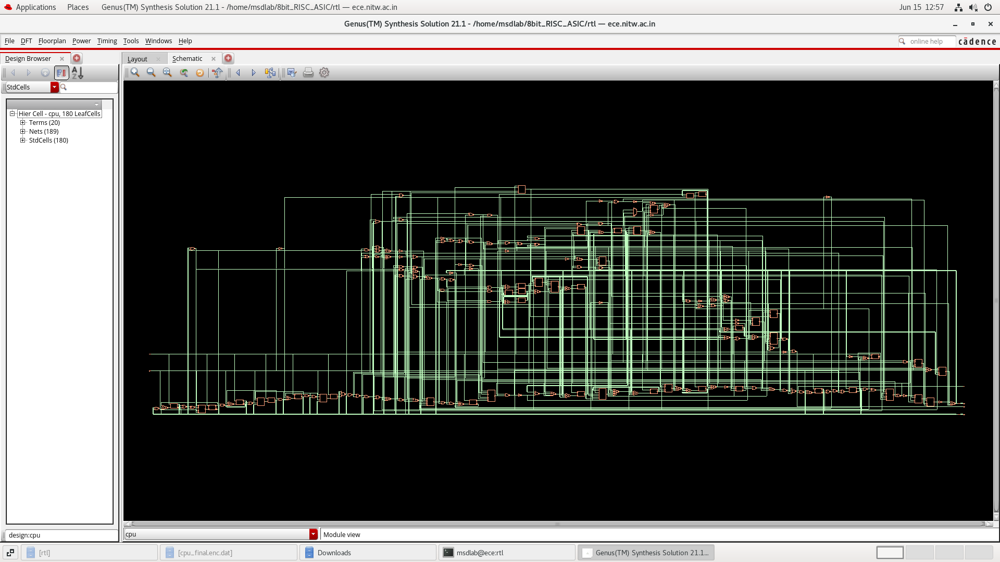

---

## Timing and Area Analysis

Following synthesis, timing and area reports were generated to evaluate the quality of the synthesized design.

The synthesized processor achieved timing closure with no timing violations reported. Area analysis provided an estimate of the silicon resources required for implementation.

### Results

| Parameter         | Value        |
| ----------------- | ------------ |
| Cell Area         | 3775.560 µm² |
| Timing Violations | 0            |
| Timing Status     | Passed       |

### Timing and Area Report

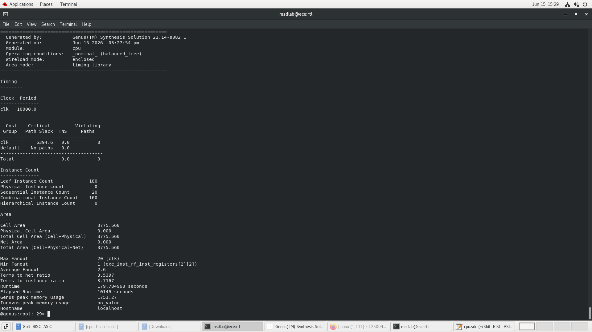

---

## Power Analysis

Power estimation was performed after synthesis to evaluate the energy consumption of the design.

The report provided information about leakage power, internal power, switching power, and total power consumption.

### Results

| Parameter   | Value            |
| ----------- | ---------------- |
| Total Power | 3.85389 × 10⁻⁴ W |

### Power Report

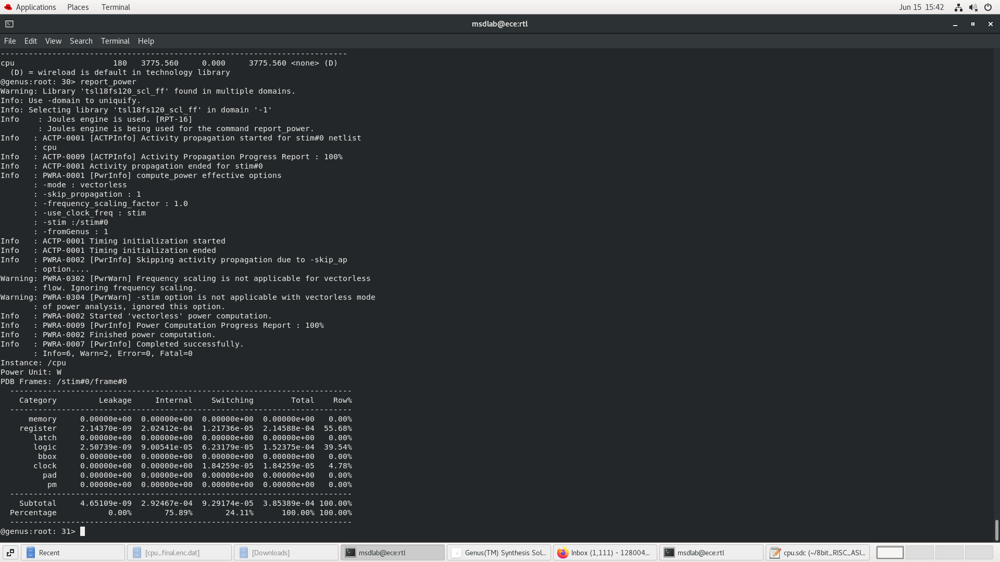

---

## Floorplanning

Floorplanning was carried out in Cadence Innovus to define the physical dimensions of the chip and allocate space for standard-cell placement.

The core area and utilization parameters were selected to provide sufficient routing resources while maintaining efficient area usage.

### Objectives

* Define chip dimensions
* Create placement rows
* Reserve routing resources
* Prepare design for placement

### Floorplan Layout

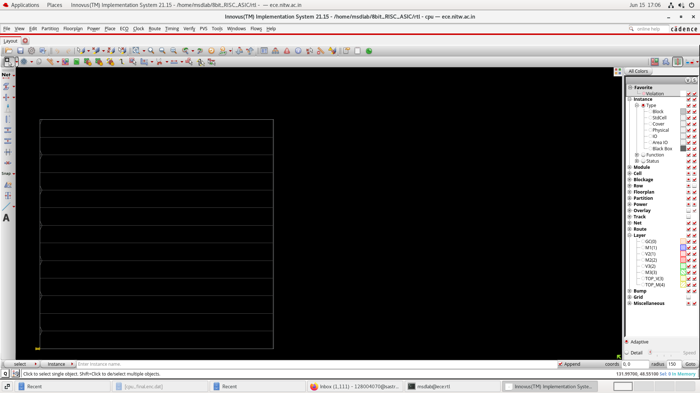

---

## Power Planning

Power planning was performed by creating power rings around the core region.

These structures distribute VDD and VSS throughout the design and provide a stable power network for all standard cells.

### Objectives

* Establish power distribution network
* Reduce voltage drop
* Improve power integrity

### Power Rings

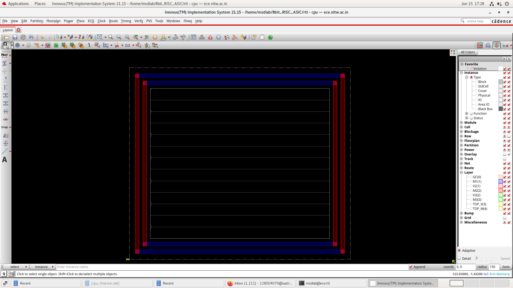

---

## Placement

After floorplanning, standard cells generated during synthesis were placed within the defined core region.

Placement optimization was performed to reduce wire length, minimize congestion, and improve timing performance.

### Objectives

* Position standard cells efficiently
* Minimize routing complexity
* Improve timing characteristics

### Placement Result

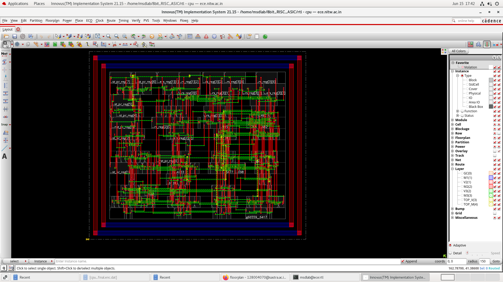

---

## Routing

Routing connected all placed cells through metal interconnect layers.

The routing stage established complete signal connectivity while satisfying design rules and routing constraints.

### Objectives

* Connect all nets
* Satisfy routing requirements
* Minimize congestion

### Routing Result

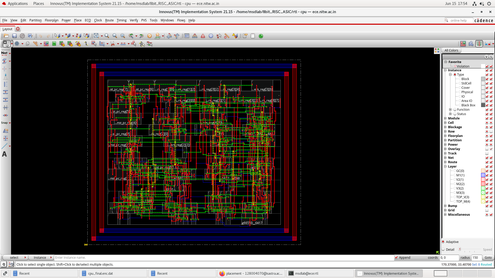

---

## Post-Route Timing Analysis

After routing, timing analysis was performed to verify that the design continued to satisfy timing constraints in its final physical form.

The timing report indicated positive slack and no timing violations.

### Results

* Positive slack achieved
* No setup violations observed
* Timing closure successfully maintained

### Timing Verification Report

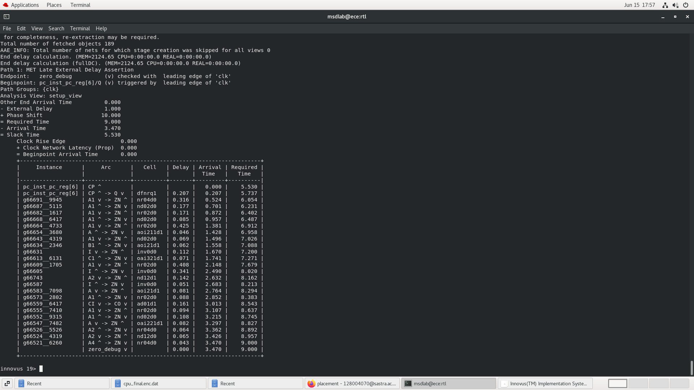

---

## Connectivity Verification

Connectivity verification was performed to ensure that all routed nets were correctly connected and that no open connections existed in the design.

The verification completed successfully without reporting connectivity violations.

### Connectivity Verification Report

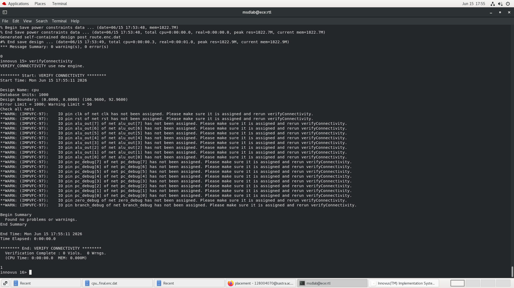

---

## DRC Verification

Design Rule Checking (DRC) was performed using Innovus verification utilities to ensure compliance with physical layout rules.

The design completed verification without any reported violations.

### Results

* DRC Violations: 0

### DRC Report

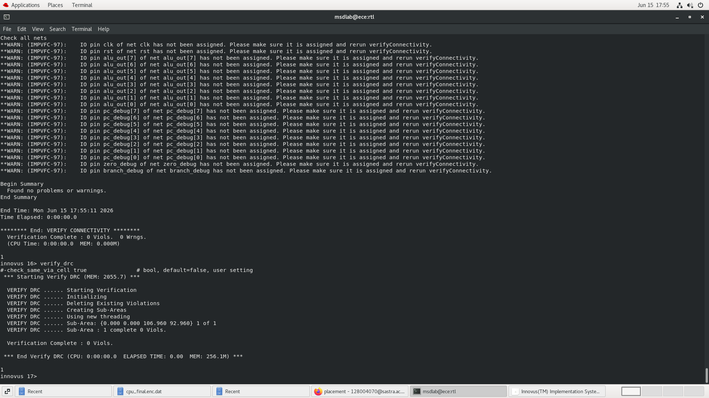

---

## Geometry Verification

Geometry verification was performed to identify possible layout integrity issues such as shorts, overlaps, antenna violations, and wiring errors.

No violations were reported during geometry verification.

### Results

* No shorts detected
* No overlaps detected
* No antenna violations detected
* Geometry verification passed

### Geometry Verification Report

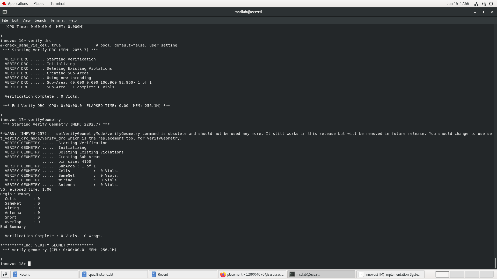

---

## Post-Synthesis Simulation

The synthesized design was functionally verified using Cadence Xcelium.

Simulation results confirmed that the gate-level implementation preserved the behavior of the original RTL design.

### Verification Objectives

* Validate processor functionality
* Verify ALU operations
* Confirm control-path behavior
* Ensure correct program execution

### Xcelium Simulation Report

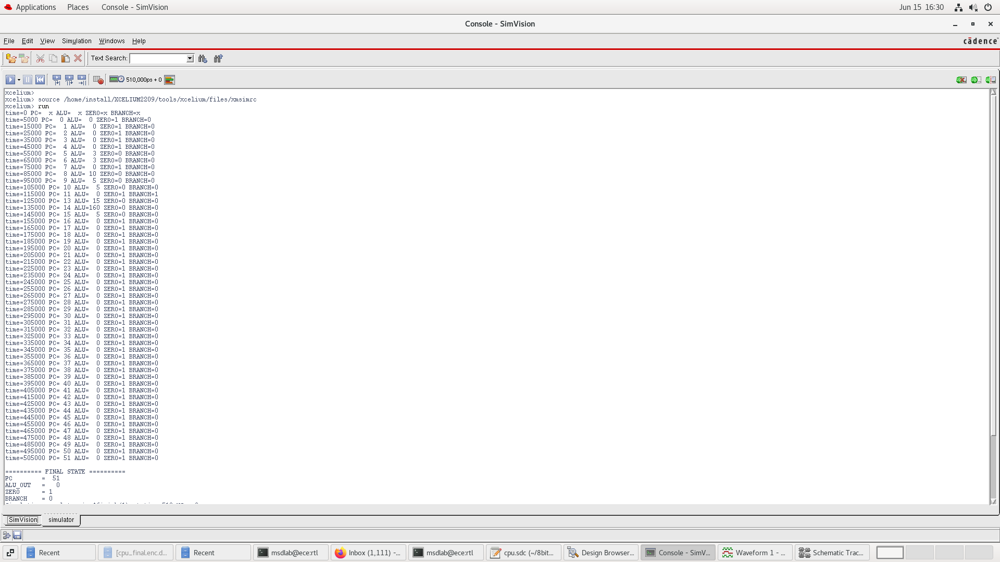

---

## Implementation Summary

The 8-bit RISC Processor was successfully implemented through the major stages of the digital ASIC flow. Logic synthesis, timing optimization, floorplanning, power planning, placement, routing, timing verification, connectivity checks, DRC verification, geometry verification, and post-synthesis simulation were completed successfully.

The final design achieved timing closure, passed physical verification checks, and demonstrated correct functionality through simulation.

---

## Future Work

To complete a full industry signoff flow, the following stages can be performed in future iterations:

* Calibre DRC Verification
* LVS (Layout Versus Schematic) Verification
* Parasitic Extraction (PEX)
* Signoff Static Timing Analysis (STA)
* Final GDSII Signoff and Tapeout Preparation
